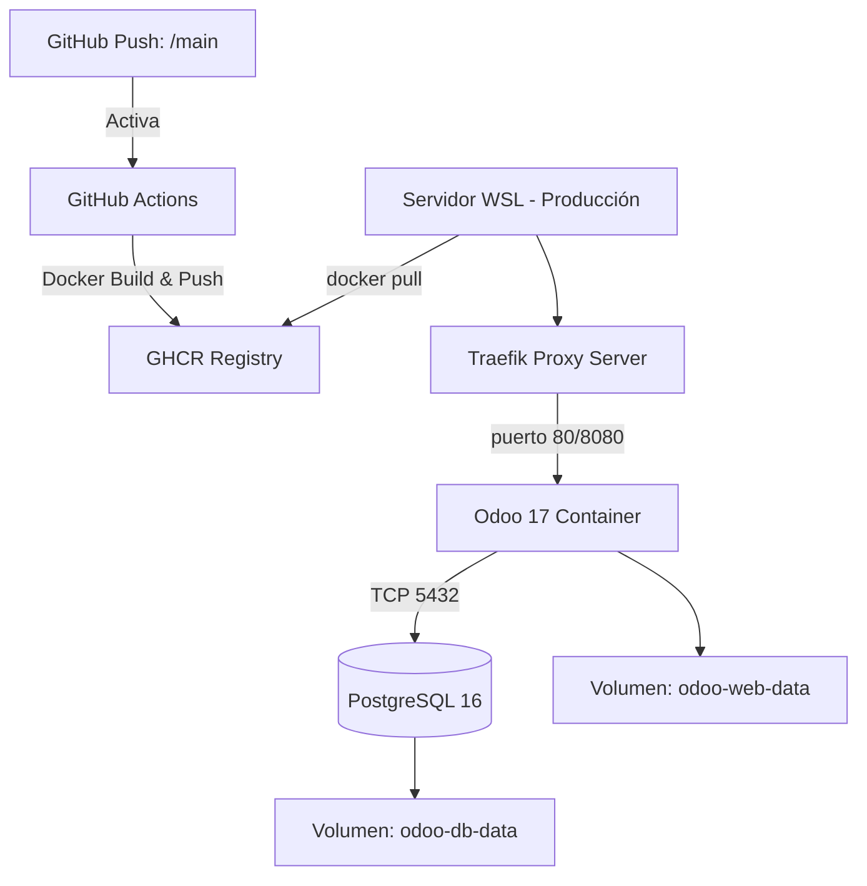

# 🏡 Sistema Municipal de Catastro - Vallegrande (Odoo 17 LTS)

 
 


Proyecto integral para la migración y modernización del sistema propietario (SIICAT, programado en PHP y PostgreSQL) hacia una potente solución *ERP Web-based*, apalancada en **Odoo 17 LTS**.
Desarrollado específicamente para manejar, liquidar y registrar la administración territorial (predios urbanos y rurales) y actividades socio-económicas del **Gobierno Autónomo Municipal de Vallegrande**.

---

## 🏗️ Arquitectura del Proyecto

El sistema está encapsulado en contenedores Docker gestionado a través de `docker-compose`. Todo el código está configurado bajo CI/CD con GitHub Actions.



## 🧩 Módulos Implementados e Integraciones

Los Addons que conforman el núcleo están siendo refactorizados aplicando una completa separación de responsabilidades:
- 🟢 **`catastro_predio`**: Administra los bienes inmuebles, sectorización, divisiones del territorio municipal y dueños.
- 🟢 **`catastro_avaluo`**: Centraliza el ciclo de vida de avalúos y precios basados en la tabla del Gobierno Municipal.
- 🟢 **`catastro_impuestos`**: *(Desarrollado en la Fase 5)* Gestiona liquidaciones fiscales asíncronamente conectadas a la caja registradora de facturas (`account`).
- 🟢 **`catastro_transferencia`**: Administra de forma rigurosa los cambios de dominio (herencias, compras), exigiendo el seguimiento (`mail.thread`) obligatorio antes de mutar los datos en el predio formal.
- 🔄 **`catastro_gravamen`**: (En desarrollo) Anotaciones preventivas e hipotecas de bancos y juzgados.
- 🔄 **`catastro_certificados`**: (En desarrollo) Motores de reportes dinámicos (QWeb/PDF).
- 🔄 **`catastro_informes`**: (En desarrollo) Generadores de estudios y líneas de cota.
- 🔄 **`catastro_mapa`**: (En desarrollo) Módulo GIS y reemplazo de backend geoespacial.

## 🚀 Instalación Inicial (Desarrollo y Pruebas Locales)

### Prerrequisitos de conectividad
Dado que Odoo se levanta a través del router Ingress de **Traefik**, es mandatorio mapear el nombre del host local en tu archivo de hosts (`/etc/hosts` en Linux/Mac o `C:\Windows\System32\drivers\etc\hosts` en Windows):
```text
127.0.0.1 catastro.local
```

### Arranque del Entorno
Ejecuta el login referenciado al paquete Container Registry de Github:
```bash
# 1. Crear la red externa global de Traefik (Si es servidor nuevo)
sudo docker network create web-proxy

# 2. Levantar toda la infraestructura (Docker descargará GHCR automáticamente)
docker compose up -d

# 3. Revisar logs en vivo para confirmar arranque seguro
docker compose logs -f odoo
```

## 🌐 Entorno de Usuarios y Configuración
Por defecto, la solución será mapeada automáticamente en tu explorador.
- **Acceso Web:** [http://catastro.local/](http://catastro.local/)
- **Acceso Monitor Traefik:** [http://catastro.local:8080/](http://catastro.local:8080/)
- **Master Password Odoo:** `catastro_admin_2026`
- **Postgresql Password:** `odoo_secret`

---

### ¿Cómo actualizar el entorno de producción (Servidor)?
El entorno de uso continuo (Desplegado típicamente en WSL/Debian/Ubuntu) posee un script automatizado ubicado en `scripts/deploy.sh`. 
Un crontab o el equipo de operaciones invoca dicho script, logrando una **disponibilidad sin cierres abruptos de Base de Datos**, inyectando localmente nuevas réplicas Docker.

```bash
bash /opt/catastro/scripts/deploy.sh
```
> El script extrae la imagen `ghcr.io/pothoko/catastro_01:latest` silenciosamente, elimina el odoo desactualizado, e idénticamente renace la aplicación preservando los repositorios de información.
